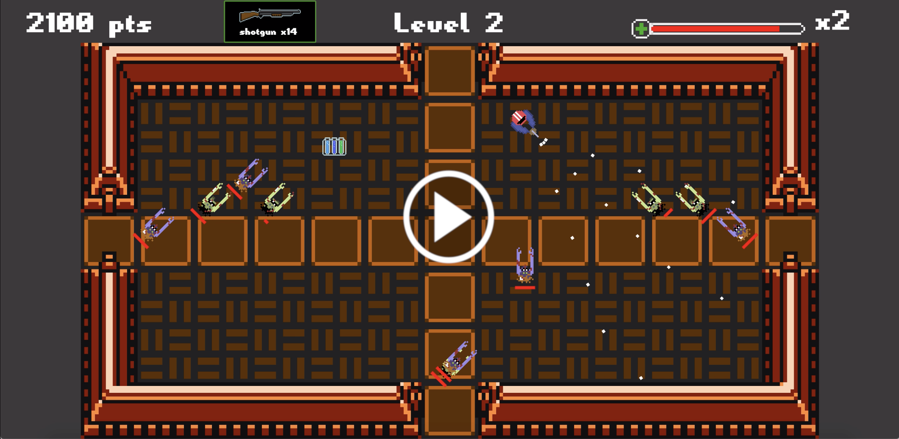

# Barrage

#### Demo Video:

### Description:
  Frontend for Barrage: A classic 80's arcade top-down arcade game.

  Clear each room of enemies before they overcome you! Grab randomly spawning pickups such as weapons and items in order to even the odds.

### Controls:
  use WASD keys to move up, left, down, and right, respectively;
  use the arrow keys to aim as you move;
  use the Space Bar to fire! (tip: hold Space down for continuous fire, rather than hitting it repetitively.)

### Dependencies:
  [barrage-backend repo](https://github.com/LaneMiller/barrage-backend)

### Live Demo:
  https://barrage-arcade.herokuapp.com/

### Local Setup:
  clone this repo + the [backend repo](https://github.com/LaneMiller/barrage-backend)

  First setup and run the backend:
  (make sure this is running on localhost port :3000)

      # /barrage-backend
      git checkout local
      bundle install
      rails db:create && rails db:migrate && rails db: seed
      rails s

  Then install and run this repo:

      # /barrage
      git checkout local
      npm install && npm start
      # Hit 'Y' for 'yes' if npm asks whether you want
      # to run the app on another port (:3000 will be taken)

  Barrage should open in your default browser automatically, but if it does not
  navigate to localhost:3001, or whatever port `npm start` started on.

## Credits:
- level tilemap: ['gauntness' by Surt](http://opengameart.org/users/surt)
- font: ['1980XX' by Void](http://arcade.itch.io)
